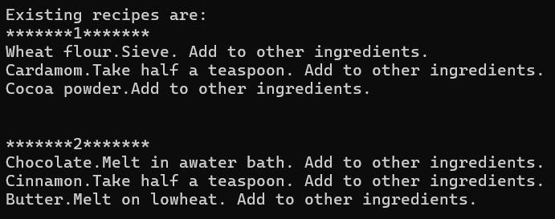
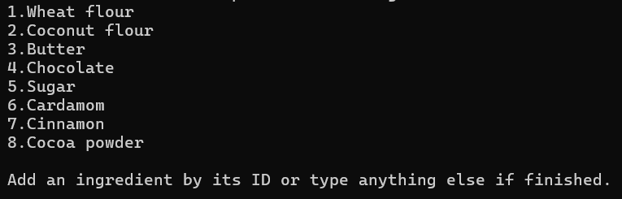
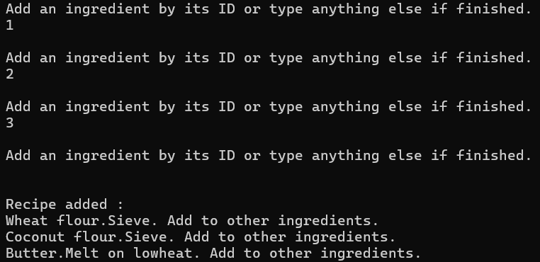
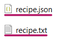

# Cookie Cookbook

This project is a C# application designed to help you manage your favorite cookie recipes using object-oriented programming principles.

## Features

- **Create and customize cookie recipes:** Easily add details like recipe name, ingredients, and instructions.

- **Flexible recipe storage:** Choose between saving your recipes in a standard text file (TXT) or a structured JSON format based on your preference.

## Benefits

- Organize your cookie recipes in one convenient location.

- Easily personalize each recipe with your favorite ingredients and variations.

- Select the file format that best suits your needs.

## Getting Started

1. Prerequisites:
   - Visual Studio (any version compatible with C#)
   - Basic understanding of C# and object-oriented programming concepts

2. Clone the repository:

   ```
   Bash

   https://github.com/tanvirtazwar/Cookie-Cookbook.git
   ```

3. Open the solution file (.sln) in your preferred IDE.

4. Build and run the application.

## Main Workflow

### 1. Startup:

1. If there are saved recipes, the application displays them all first. 

   

2. Regardless of existing recipes, the application prompts you to create a new cookie recipe.

   `Create a newcookie recipe! Available ingredients are:`

### 2. Creating a New Recipe :

1. A list of available ingredients is displayed.

   

2. You can then select ingredients for your recipe by entering their IDs.

### 3. Finalizing the Recipe:

1. You can select ingredients by typing their corresponding ID displayed on the console.

2. If no ingredients are selected, the application informs you and doesn't save anything.

   `No ingredients have been selected. Recipe will not be saved.`

3. to create a shortbread recipe, select ingredients like flour (ID might be 1), sugar (ID 2), and butter (ID 3).

5. Once you've finished adding ingredients, press any key that is not a valid ingredient ID.

6. The application will confirm that the recipe has been successfully added.

   

### 4. Program Termination:

- The application prompts you `Press any key to exit.` to exit. 

## File Storage:

- The application supports saving recipes in either JSON or TXT format.
  
  

- By default, the initial format and name of the file might be set within the program's code.
  
  ```
  if (textFormat is TextFormat.Txt) return "recipe.txt";
  else if (textFormat is TextFormat.Json) return "recipe.json";
  throw new NotImplementedException();
  ```
- You can modify this variable's value to simulate switching between JSON and TXT formats.

  `TextFormat fileType = TextFormat.Json;`
  or
  `TextFormat fileType = TextFormat.TXT;`


